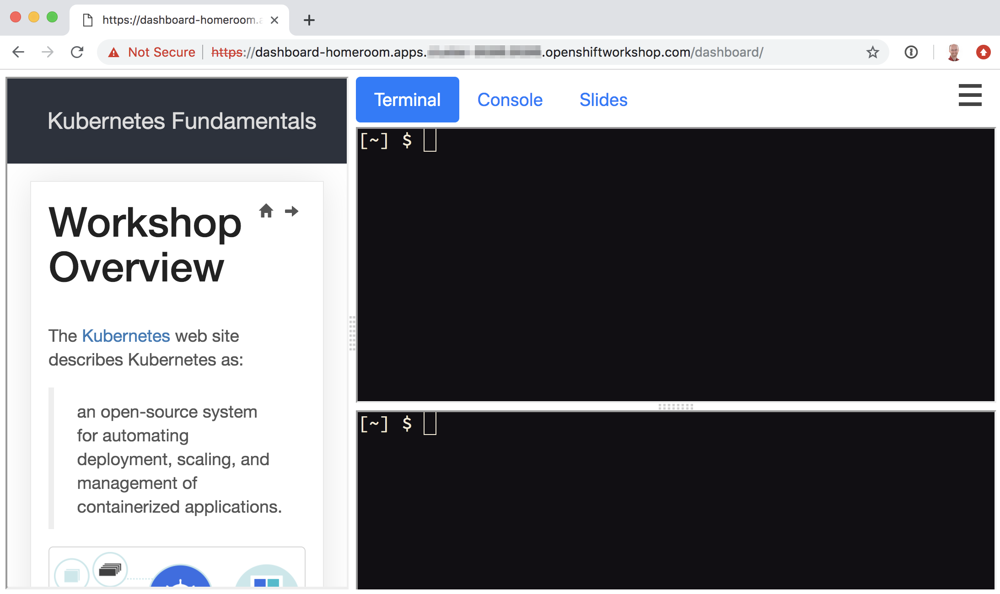
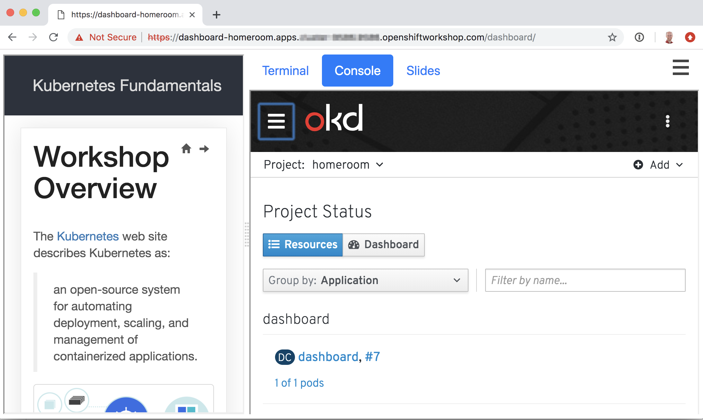
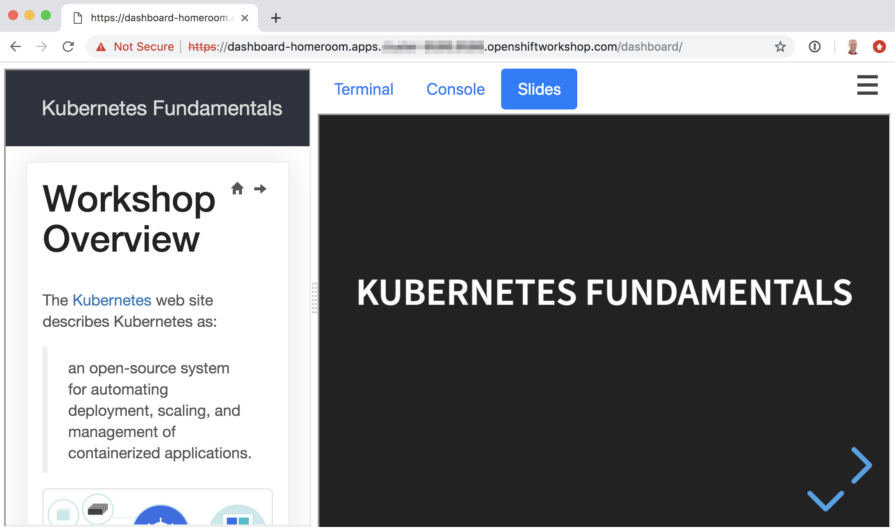

Workshop Dashboard
==================

This repository contains software for deploying a containerised workshop environment in OpenShift. It is intended to be used in self paced or supervised workshops where users need access to command line clients and other tools when working with OpenShift, and you want to avoid needing to have users install anything on their own local computer.

Users are provided access to a dashboard combining workshop content and a shell environment via a terminal in their web browser.



The dashboard can embed access to the OpenShift web console for the cluster being used.



A workshop can also includes slides, which a user or the workshop presenter can use.



The dashboard image builds on a separate workshop terminal image which provides the following command line clients, tools and software stacks:

* Editors: ``vi``/``vim``, ``nano``.
* Kubernetes clients: ``kubectl``
* OpenShift clients: ``oc``, ``odo``.
* Language runtimes: ``java``, ``node.js``, ``python``, ``ruby``.

For the language runtimes, commonly used packaging tools for working with that language are also included.

Quick start instructions
------------------------

To quickly see what the workshop environment looks like, run:

```
oc new-app https://raw.githubusercontent.com/openshift-labs/workshop-dashboard/master/templates/production.json
```

This will deploy an instance of the user environment as a standalone deployment. The name of the deployment will by default be ``dashboard``.

To determine the hostname assigned to the route which you need to use in the URL to access the terminal, run:

```
oc get route/dashboard
```

When you access the URL for the dashboard, you will if necessary be redirected to the login page for the OpenShift cluster the dashboard is deployed to. You should enter your login and password for the OpenShift cluster.

After you have supplied your credentials, you will be granted access to the dashboard.

Note that you will only be granted access to the dashboard if your are listed as a project admin for the project the dashboard is deployed to. Users of the OpenShift cluster who are members of your project but who only have edit or view access, or users who are not a collaborator of your project, will not be granted access to the dashboard.

When you use the ``oc`` and ``kubectl`` command line tools from the terminal, you will already be logged into the cluster as a special service account user. You should have the same rights as a project admin for that project. If you need the full access rights of your original OpenShift user, run ``oc login`` and login as your actual user.

Note that if you do login using ``oc login`` as an actual user, the embedded web console will still only allow access to the original project as the special service account user that is created.

To delete the deployment when done, run:

```
oc delete all,serviceaccount,rolebinding,configmap -l app=dashboard
```

Deploying an existing workshop
------------------------------

The workshop content when the above command is used will be some sample content used to test the environment is working correctly.

If you know the name of a custom workshop image hosted on an image registry, which someone has created, you can deploy it by providing the ``TERMINAL_IMAGE`` template parameter:

```
oc new-app https://raw.githubusercontent.com/openshift-labs/workshop-dashboard/master/templates/production.json \
  --param TERMINAL_IMAGE="quay.io/openshiftlabs/lab-kubernetes-fundamentals:master"
```

Create a new project, deploy the workshop, and when done, delete the project.

Creating multiple terminals
---------------------------

Depending on what the workshop requires, it will be setup in advance to provide you with one or two terminals displayed within the dashboard. If you want to create additional terminal sessions, you can access the menu top right of the dashboard and select "Open Terminal". This will create you a new terminal session each time.

Note that although this will provide you with a separate terminal session, it is still running your shell in the same container as all other terminal sessions. Seperate containers are not created.

This means you cannot use this mechanism as a means of providing access to multiple users. If you do and are using command line tools such as ``oc`` or ``kubectl``, the users will interfere with each other, as the terminal sessions share the same home directory.

Running a multi user workshop
-----------------------------

If you want to run a multi user workshop, you could deploy the workshop environment for each user into a separate project where the user is an admin of that project. A better approach is to use the multi user [workshop spawner](https://github.com/openshift-labs/workshop-spawner) application.

Note that not all custom workshop images may be setup to be able to be used in a multi user environment, and vice versa, one that works in a multiple user environment may not work in a single user environment. This is because the deployment environment can be different, and so a workshop may have been setup only to be used with a specific type of deployment environment. You should check any information provided about a custom workshop to show how it should be deployed.
